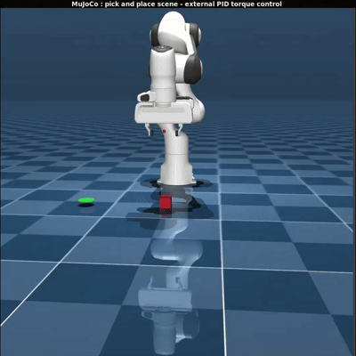

<div align="center">

# Vision-Free Collision-Aware Panda Manipulation

### Benchmarking PPO + PID vs. IK + PID for Pick-and-Place

<!-- Upload your demo GIF and replace the path below -->


<br/>


*A reinforcement learning and classical-control pipeline for training and evaluating a Franka Emika Panda 7-DOF manipulator on vision-free pick-and-place tasks in MuJoCo.*

</div>

---

## Overview

This repository implements a **vision-free pick-and-place benchmark** for a Franka Emika Panda 7-DOF manipulator in MuJoCo. Two high-level control strategies are compared while the low-level PID torque controller is held common:

1. **PPO + PID** — PPO generates desired joint positions; an external PID converts them into torque commands.
2. **IK + PID** — Inverse kinematics generates desired joint positions; the **same** PID converts them into torque commands.

Object and target states are read directly from the simulation rather than detected from camera images. The goal is to test whether a learned policy can complete the full pick-and-place sequence under a shared torque-control layer.

```text
PPO Policy  ──┐
              ├──> Desired Joint Positions ──> External PID ──> Torques ──> MuJoCo
Inverse Kin ──┘
```

Because the low-level layer is identical, the comparison isolates the **high-level motion generator**.

---

## Setup

| Item | Value |
|---|---|
| Robot | Franka Emika Panda (7 arm joints + 1 gripper actuator) |
| Simulator | MuJoCo |
| Task | Vision-free pick-and-place |
| Control | External joint-space torque PID |
| RL algorithm | PPO (Stable-Baselines3) |
| Observation | 29-D vector |
| Action | 8-D `[a0…a6, gripper]` |

The first seven actions modify desired joint positions, which the PID then tracks.

**Task configuration**

```text
Target (fixed):  [0.45, -0.30, 0.02] m

Object (randomized during training):
X ∈ [0.35, 0.55] m
Y ∈ [-0.15, 0.15] m
Z = 0.05 m
```

---

## PPO Training

Final model: **7,000,000 timesteps** across **8 parallel environments**.

| Parameter | Value | Parameter | Value |
|---|---|---|---|
| Policy | MlpPolicy | GAE lambda | 0.95 |
| Learning rate | 3e-4 | Clip range | 0.20 |
| `n_steps` | 1024 | Entropy coef. | 0.01 |
| Batch size | 256 | Value coef. | 0.5 |
| Epochs/update | 10 | Max grad norm | 0.5 |
| Gamma | 0.99 | Network | [256, 256] |
| Seed | 42 | VecNormalize | Enabled |

**Low-level PID gains**

```text
KP = [400, 400, 400, 400, 180, 100, 40]
KI = [ 10,  10,  10,  10,   5,   5,  2]
KD = [ 60,  60,  60,  60,  25,  18,  8]
```

PID torque is combined with MuJoCo bias/gravity compensation and bounded by actuator torque limits.

**Pre-training verification** confirmed the full pipeline (`PPO → desired q → PID → torque → MuJoCo`): 8 actuators present, first 7 pure torque motors, obs = 29, action = 8, object randomized with fixed target, PID output bounded, and 200 randomized control steps without NaN/Inf (max |q| 2.688 rad, max |dq| 0.336 rad/s, max |τ| 42.34 Nm). This verified PPO actions passed through the PID torque layer rather than driving MuJoCo joint positions directly.

---

## Reward and Task Logic

The environment uses staged objectives: end-effector approach → object proximity → gripper interaction → grasp → lift → transport → target approach → controlled placement → valid release → return to home → episode completion. Placement-stability logic prevents rewarding an unstable release near the target, so a successful episode means the **full pick-and-place sequence** completed, not merely reaching the target once.

---

## Results

### 1. PPO 100-Trial Validation

Evaluated over 100 randomized object positions with the fixed training target.

| Metric | PPO + PID |
|---|---|
| Success rate | **99.0%** |
| Ever grasped/lifted | **100.0%** |
| Mean net target progress | +213.5 mm |
| Mean max object height | 106.0 mm |
| Mean best distance while holding | 16.6 mm |

Single failure — Trial 16: 300 steps, final distance 100.0 mm, best holding distance 58.9 mm.

> **Key result:** 99% complete-task success and 100% grasp/lift occurrence over 100 randomized-object trials.

### 2. Paired Randomized-Object Comparison (primary benchmark)

The same 50 object configurations are generated once and reused by both controllers, with the target fixed at the PPO training target.

```text
Object:  X ∈ [0.39, 0.51] m,  Y ∈ [-0.09, 0.09] m
Target:  [0.45, -0.30, 0.02] m
```

| Metric | PPO + PID | IK + PID |
|---|---|---|
| Success rate | 78.0% | **100.0%** |
| Mean final distance | 151.45 mm | **7.48 mm** |
| Median final distance | 14.56 mm | **6.01 mm** |
| Mean episode time | 0.300 s | 0.264 s |
| Episodes | 50 | 50 |

> IK + PID completed all 50 trials; PPO + PID completed 39.

PPO's large mean final distance is driven by a small number of large-distance failures — its median is substantially smaller than its mean.

### 3. Randomized-Target Generalization Experiment

An earlier run randomized **both** object and target. Since the final PPO model was trained with a fixed target, this target distribution lies outside its training setup and is reported separately.

| Metric | PPO + PID | IK + PID |
|---|---|---|
| Success rate | 78.0% | **100.0%** |
| Mean final distance | 136.70 mm | **8.94 mm** |
| Median final distance | 40.71 mm | **6.23 mm** |
| Mean episode time | 0.449 s | 0.264 s |

---

## Evaluation Methodology

```text
Generate object position
        ↓
        ├───────────────┐
        ↓               ↓
   PPO + PID         IK + PID
        ↓               ↓
     Same MuJoCo task configuration
```

The task set is generated once from a fixed seed and reused, so neither controller sees a different task distribution. The target stays fixed at `[0.45, -0.30, 0.02] m`, matching PPO training. Randomized-target evaluation is treated as a separate generalization test.

The environment is **vision-free**: object and target positions are available directly. Camera perception, object detection, and visual servoing are out of scope.

---

## Project Structure

```text
Manipulator/
├── src/
│   ├── rl_env.py                  # PPO pick-and-place environment
│   ├── pid_controller.py          # External joint-space PID
│   └── kinematics.py              # Forward/inverse kinematics utilities
├── mujoco_menagerie/
│   └── franka_emika_panda/        # Panda MuJoCo model and scenes
├── models/
│   ├── ppo_panda_pid_final.zip
│   └── ppo_panda_pid_vecnormalize.pkl
├── logs/                          # PPO training logs
├── evaluation_results_fair_randomized/
│   ├── fair_randomized_comparison.csv
│   ├── fair_randomized_success_rate.png
│   ├── fair_randomized_final_distance.png
│   └── fair_randomized_episode_time.png
├── train_rl.py                    # PPO training
├── test_rl.py                     # PPO validation
├── test_pid.py                    # Classical controller testing
├── live_test_rl.py                # PPO live evaluation
├── live_test_pid.py               # IK + PID live evaluation
├── evaluate_ppo_pid.py            # Paired benchmark
├── README.md
├── .gitignore
└── .env
```

---

## Installation and Usage

```bash
pip install mujoco stable-baselines3 gymnasium numpy matplotlib
```

Requires the Panda model files in `mujoco_menagerie/franka_emika_panda/`.

```bash
python3 train_rl.py          # Train PPO (saves models/ppo_panda_pid_final.zip + vecnormalize.pkl)
python3 test_rl.py           # PPO + PID validation over randomized object positions
python3 live_test_pid.py     # Classical IK + PID evaluation
python3 evaluate_ppo_pid.py  # Paired PPO + PID vs IK + PID benchmark
```

The paired benchmark generates the task set once, randomizes only the object position, keeps the target fixed, runs both controllers on identical configurations, then computes success rate, final placement distance and episode wall time, saving CSV results and comparison plots.

---

## Key Findings

1. PPO + PID successfully learned the complete pick-and-place task.
2. The final model achieved **99% success** over 100 randomized-object validation trials, with **100% grasp/lift occurrence**.
3. In the paired 50-task fixed-target comparison, PPO + PID reached **78% success** versus **100%** for IK + PID.
4. IK + PID produced lower mean and median final placement distance in the paired benchmark.
5. PPO failures concentrated in a small number of trials with very large final distances.
6. The common PID torque layer ensures the main architectural difference is the high-level desired-joint-position generator.

---

## Limitations

- PPO was trained with a fixed target, so the primary evaluation also uses a fixed target.
- Vision-free; assumes direct access to object/target state.
- One Panda simulation configuration; 50 paired tasks — larger sets would give stronger statistical confidence.
- Deterministic inference was used for reported evaluation.
- Final-distance statistics are sensitive to catastrophic failures and should be read alongside success rate and median distance.
- Simulation only; no real-world hardware validation.

---

## Future Work

Randomized-target PPO training · domain randomization of mass, friction and dynamics · collision-aware reward shaping · obstacle-based manipulation · vision-based object localization · sim-to-real transfer · larger paired evaluations with confidence intervals and significance testing · multi-object sequential pick-and-place · comparison with additional learned and classical controllers.

---

## Citation / Project Description

> **A vision-free reinforcement-learning-based pick-and-place controller for a Franka Panda 7-DOF manipulator, where PPO generates desired joint positions and an external PID controller converts them into torque commands for MuJoCo simulation. The learned controller is evaluated against a classical IK+PID pipeline using paired randomized object configurations and a common fixed target.**